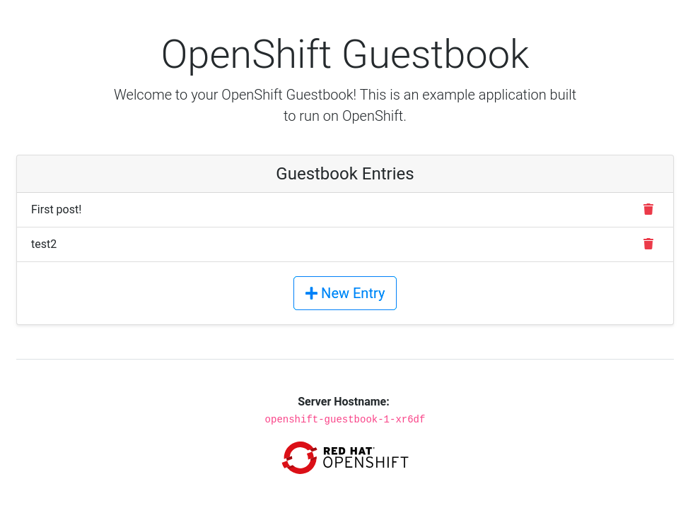

# OpenShift Guestbook

This is an example guestbook application that you can use as the starting
point to develop your own and deploy it on an [OpenShift][openshift] cluster.

[openshift]: https://github.com/openshift/origin

The steps in this document assume that you have access to an OpenShift
deployment that you can deploy applications on.



## Special files in this repository

Apart from the regular files created by Django, this repository contains:

```
openshift/         - OpenShift-specific files
└── templates      - application templates

requirements.txt   - list of dependencies
```

## Deploying to OpenShift

To follow the next steps, you need to be logged in to an OpenShift cluster
and have an OpenShift project where you can work on.

The directory `openshift/templates/` contains OpenShift application templates
that you can add to your OpenShift project with:

```bash
oc create -f openshift/templates/<TEMPLATE_NAME>.yml
```

### Ephemeral

The template `openshift-guestbook.yml` contains a PostgreSQL database service
and an Image Stream for the Python base image. For simplicity, the PostgreSQL
database in this template uses ephemeral storage and, therefore, is not
production ready.

### Persistent

The template `openshift-guestbook-persistent.yml` contains all of the components
from `openshift-guestbook.yml`, plus a persistent volume claim to enable
persistent storage for the PostgreSQL database.

### Using an application template

After adding your templates, you can go to your OpenShift web console, browse to
your project and click the create button. Create a new app from one of the
templates that you have just added.

Adjust the parameter values to suit your configuration. Most times you can just
accept the default values, however you will probably want to set the
`GIT_REPOSITORY` parameter to point to your fork and the `DATABASE_*` parameters
to match your database configuration.

Alternatively, you can use the command line to create your new app, assuming your
OpenShift deployment has the default set of ImageStreams defined.  Instructions
for installing the default ImageStreams are available [here][image_streams]. If you
are defining the set of ImageStreams now, remember to pass in the proper
cluster-admin credentials and to create the ImageStreams in the 'openshift'
namespace:

[image_streams]: https://docs.openshift.org/latest/install_config/imagestreams_templates.html

```bash
oc new-app openshift/templates/openshift-guestbook.yml
```

Your application will be built and deployed automatically. If that doesn't
happen, you can debug your build:

```bash
oc get builds
# take build name from the command above
oc logs build/<build-name>
```

And you can see information about your deployment too:

```bash
oc describe dc/openshift-guestbook
```

In the web console, the overview tab shows you a service, by default called
"openshift-guestbook", that encapsulates all pods running your Django application.
You can access your application by browsing to the service's IP address and port.
You can determine these by running:

```bash
oc get svc
```

## Special environment variables

### APP_CONFIG

You can fine tune the gunicorn configuration through the environment variable
`APP_CONFIG` that, when set, should point to a config file as documented [here][gunicorn_app_config].

[gunicorn_app_config]: http://docs.gunicorn.org/en/latest/settings.html

### DJANGO_SECRET_KEY

When using one of the templates provided in this repository, this environment
variable has its value automatically generated. For security purposes, make
sure to set this to a random string as documented [here][django_secret_key].

[django_secret_key]: https://docs.djangoproject.com/en/1.8/ref/settings/#std:setting-SECRET_KEY

## License

This code is dedicated to the public domain to the maximum extent permitted by
applicable law, pursuant to [CC0](http://creativecommons.org/publicdomain/zero/1.0/).
